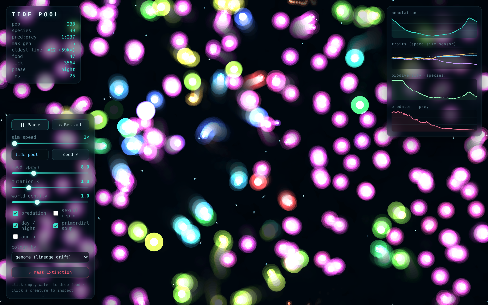

# 🌊 TIDE POOL

An artificial-life sandbox where organisms with **evolvable brains** eat, die,
reproduce, mutate, and speciate entirely on their own — with **no fitness
function** telling them what to do. Selection is not imposed; it *emerges* from a
simple energy economy. Leave it running and watch lineages radiate into the dark.



```
no build step · no dependencies · no network · ~60fps with hundreds of agents
```

## Run it

Just open `index.html` in a modern browser (double-click works — everything is
plain `<script>` tags, no modules, no bundler). If your browser is strict about
local files, serve it:

```bash
python3 -m http.server      # then visit http://localhost:8000
```

There is also a headless harness for inspecting/tuning the evolution in Node
(no dependencies):

```bash
node test/headless.js <seed> <ticks>   # population & trait trajectory
node test/perf.js                      # step timing at the population cap
```

---

## The model

### Organisms are genomes

Every organism is a single flat numeric vector — its **genome**. The first eight
values are "body plan" genes (stored 0..1, mapped to real ranges); everything
after that is the raw weight vector of the organism's brain.

| gene | meaning |
|------|---------|
| `size` | body radius — bigger can prey on smaller, but costs much more energy |
| `maxSpeed` | top speed; movement cost grows with speed² |
| `sensorRange` | how far it can see food and other organisms |
| `metabolism` | upkeep multiplier |
| `diet` | position on the herbivore (0) ↔ predator (1) spectrum |
| `reproThreshold` | energy needed to split |
| `mutationRate` | this organism's own (evolvable!) per-gene mutation size |
| `hue` | a **neutral marker** with no direct effect — see below |

The **hue** gene is deliberately under no selection. It just drifts with mutation,
so as a lineage persists its descendants slowly wander in colour. The screen
therefore bands into colours that map directly onto ancestry — *neutral genetic
drift, made visible.* (You can also colour by diet, by lineage id, or by energy.)

### Each organism has a tiny evolved brain

A small feedforward neural net (`8 → 8 → 8 → 3`, tanh) whose weights live inside
the genome. Nothing about its behaviour is hard-coded.

**Inputs (8):** direction (as heading-relative sin/cos) and proximity to the
nearest food; direction, proximity, and relative size of the nearest organism;
and its own energy level.

**Outputs (3):** turn, thrust, and attack-drive.

Because the weights are part of the genome, foraging, fleeing, and hunting are
all **learned by evolution** — mutation and selection, no gradient descent, no
explicit reward. Early random brains are terrible at it; the ones that happen to
steer toward food eat, reproduce, and pass on slightly better weights.

### The energy economy *is* the selection pressure

There is no fitness function anywhere in the code. Instead:

- **Existing costs energy** (scaled by metabolism and, super-linearly, by size).
- **Moving costs energy** (∝ speed²), as does being **crowded**.
- **Eating food** restores energy — efficiently for herbivores, poorly for
  predators.
- **Predation:** if predation is on, a sufficiently larger organism whose brain
  fires "attack" while touching a smaller one drains its energy. The payoff
  scales with how carnivorous (`diet`) the attacker is.
- **Zero energy → death.** No corpse, no appeal.
- **Energy above `reproThreshold` → asexual fission:** the parent splits its
  energy in half with a **mutated** daughter cell.

Who survives and who reproduces falls out *entirely* of these rules. A genome
that spends more than it earns simply disappears.

### The world

A toroidal (edge-wrapping) sea. Food spawns continuously as faint drifting
plankton, up to a density-dependent cap, modulated by a slow day/night cycle.
Neighbour queries (nearest food / nearest organism / crowding) use a **uniform
spatial hash**, so the simulation stays roughly O(n) and holds ~60fps with
hundreds of organisms instead of degrading into O(n²).

Determinism is best-effort: every random draw routes through one seeded RNG
(mulberry32), so a given seed reproduces a given run closely (floating-point
permitting).

### A note on "primordial soup"

If a world nearly dies (fewer than a handful of organisms), fresh random cells
trickle in so a run can recover rather than sitting empty forever. This only ever
fires at the brink of total extinction, so it never overrides selection in a
healthy reef. Toggle it off if you want runs that can truly end.

---

## Field guide — phenomena to watch for

This is a real evolving system, so every seed tells a different story. Things you
will genuinely see (not scripted):

- **Foraging evolves from nothing.** Right after a reseed, motion is aimless and
  the population sags as random brains starve amid uneaten food. Within a few
  hundred ticks, descendants of the lucky few that drifted into food begin to
  *steer*, and the population climbs. Generation depth (HUD: `max gen`) ticks up
  as this happens.

- **Speciation / colour-banding.** Watch the hues separate into distinct drifting
  bands — each band is a dynasty. The **biodiversity** chart (species richness via
  genome clustering) rises as niches fill and collapses through bottlenecks.

- **Predator–prey oscillations.** Turn on predation (default) and watch the
  **predator:prey** chart. Predators boom when prey are dense, then crash as they
  over-hunt, letting prey rebound — the classic coupled oscillation. In some
  seeds predators stabilise into a permanent minority; in others they flare up and
  go extinct, leaving a herbivore world. Crank **food spawn** and **density** to
  make predator booms more likely (denser prey = a richer hunting ground).

- **Evolutionary arms races.** Size is predation armour (you can only be eaten by
  something meaningfully bigger), so prey are pushed larger — until the
  super-linear energy cost of size pushes back. Sensor range, speed, and
  metabolism all get tuned against each other. The **traits** chart shows these
  population averages drifting over time.

- **Recovery after a mass extinction.** Hit **☄ Mass Extinction** (or press `X`)
  to wipe ~90% of the population. The survivors are a tiny, lucky genetic sample —
  watch biodiversity crater, then *re-radiate* as the survivors refill the empty
  niches, often into a noticeably different ecosystem than before. This is the
  most rewarding thing to do in the whole sim.

- **Evolvable mutation rate.** Because each genome carries its own mutation rate,
  you'll sometimes see lineages that "turn up" their own mutability during chaotic
  periods and settle down once adapted.

---

## Controls

- **Pause / Play** (`Space`), **Restart**, **sim speed** 1×–50× (time-budgeted so
  the UI never locks up), and a **seed** field for reproducible runs.
- **Sliders:** food spawn rate, global mutation-rate multiplier, world density.
- **Toggles:** predation, sexual reproduction (uniform genome crossover with a
  nearby mate), day/night cycle, primordial soup, audio.
- **Colour by:** genome (lineage drift), diet, lineage id, or energy.
- **Click empty water** to drop food; **click a creature** to inspect it.
- **☄ Mass Extinction** (`X`).

### Inspector

Click any organism to open its inspector: live energy, age, offspring count,
generation, and lineage id; a bar readout of its genome; and a **heatmap of its
brain weights** (red = excitatory, blue = inhibitory). **Export** an interesting
specimen's genome as JSON, and **re-inject** a saved genome later — drop a
champion forager into a struggling world and watch its line take over.

---

## Code layout

Everything is small, modular, and commented. The simulation core is
environment-agnostic (no DOM), which is what lets the same files run under Node
for tuning.

```
js/
  rng.js        seeded PRNG (mulberry32) + gaussian
  config.js     all tunable constants + the genome layout
  genome.js     create / mutate / crossover / decode / JSON
  brain.js      feedforward net (a view over the genome's weights)
  spatial.js    toroidal uniform spatial hash for neighbour queries
  organism.js   one agent: sense → think → act → pay → eat/attack/split/die
  world.js      the simulation: ticks, food, lineages, stats, extinctions
  render.js     Canvas2D bioluminescent rendering + brain heatmap
  charts.js     time-series sparklines
  audio.js      optional subtle Web Audio ambience
  ui.js         DOM controls, inspector, pointer interaction
  main.js       boot + the time-budgeted animation loop
test/
  headless.js   run the core in Node and print the trajectory
  perf.js       step-timing stress test at the population cap
```

---

## Design notes / honest caveats

- The economy is tuned so the *default* world is populous and lively regardless of
  seed luck, while still letting different seeds diverge into genuinely different
  ecosystems. The biggest lever on the character of a run is the **food spawn /
  density** pair: sparse worlds favour lean, fast specialists; rich worlds support
  big populations and predator booms.
- "Species richness" is greedy genome clustering — a cheap, glanceable proxy, not
  a phylogenetic ground truth.
- Determinism is best-effort. Identical seeds give near-identical runs; tiny
  floating-point differences across machines can eventually diverge.

Built to be left running. Enjoy the reef.
